# Backup System Documentation

## Overview

The backup system provides robust, automated backup capabilities for the Directus CMS, including PostgreSQL database dumps and incremental backups of the uploads directory. The system is designed to be reliable, efficient, and configurable, ensuring data safety while minimizing storage requirements.

## Features

- **Compressed Database Backups**: PostgreSQL database dumps with gzip compression
- **Incremental Uploads Backups**: Space-efficient backups using hardlinks
- **Configurable Retention Policies**: Control backup storage by time and count
- **Error Handling**: Comprehensive error detection and recovery
- **Detailed Logging**: Extensive logging for troubleshooting
- **Failure Analysis**: Preservation of error information for diagnostics

## Backup Process Flow

```mermaid
flowchart TD
    A[Start Backup Process] --> A1[Load Environment Variables]
    A1 --> A2[Apply Configuration Settings]
    A2 --> INIT
    
    subgraph INIT[Initialization Process]
        direction LR
        B[Initialize Directories] --> B1[Setup Paths & Directories]
        B1 --> B3[Check Required Commands]
        B3 --> B4[Setup Job & Verify Environment]
    end
    
    INIT --> C{Initialize Successful?}
    
    C -->|Yes| DB_BACKUP
    
    subgraph DB_BACKUP[Database Backup Process]
        direction TB
        D[Backup Database] --> D1[Execute pg_dump via Docker]
        D1 --> D2[Save SQL to Temporary File]
        D2 --> D3[Verify Backup Size]
    end
    
    DB_BACKUP --> E{Database Backup Successful?}
    
    E -->|Yes| UPLOADS_BACKUP
    
    subgraph UPLOADS_BACKUP[Uploads Backup Process]
        direction TB
        F[Backup Uploads] --> F1{Previous Backup Exists?}
        F1 -->|Yes| F2[Incremental Backup with Hardlinks]
        F1 -->|No| F3[Full Backup]
    end
    
    UPLOADS_BACKUP --> G{Uploads Backup Successful?}
    
    G -->|Yes| COMPRESS
    
    subgraph COMPRESS[Compression Process]
        direction TB
        H[Compress Database File] --> H1{gzip Available?}
        H1 -->|Yes| H2[Apply gzip Compression]
        H1 -->|No| H5[Skip Compression]
        H2 --> H3[Calculate Compression Ratio]
        H3 --> H4{Compression Successful?}
        H4 -->|Yes| H6[Move Compressed File]
        H4 -->|No| H5
    end
    
    COMPRESS --> FINALIZE
    
    subgraph FINALIZE[Finalization Process]
        direction TB
        I[Finalize Backup] --> I1[Create Final Backup Directory]
        I1 --> I2[Move Database Backup]
        I2 --> I3[Move Uploads Directory]
        I3 --> I4[Update 'latest' Symlink]
        I4 --> I5[Remove Temporary Directory]
    end
    
    FINALIZE --> J{Finalize Successful?}
    
    J -->|Yes| CLEANUP
    
    subgraph CLEANUP[Cleanup Process]
        direction TB
        K[Run Cleanup] --> K1[Remove Old Temporary Dirs]
        K1 --> K2[Remove Incomplete Backups]
        K2 --> K3[Count Valid Backups]
        K3 --> K4{Retention Days Policy Active?}
        K4 -->|Yes| K5{bc Available?}
        K5 -->|Yes| K6[Calculate Cutoff with bc]
        K5 -->|No| K7[Calculate Cutoff with Shell]
        K6 --> K8[Remove Backups Older Than Threshold]
        K7 --> K8
        K4 -->|No| K9
        K8 --> K9{Retention Count Policy Active?}
        K9 -->|Yes| K10[Remove Excess Backups by Count]
        K9 -->|No| K11[Keep All Complete Backups]
        K10 --> K12[Clean Old Error Logs]
        K11 --> K12
    end
    
    CLEANUP --> L[End Process]
    
    C -->|No| ERROR
    E -->|No| ERROR
    G -->|No| ERROR
    J -->|No| ERROR
    
    subgraph ERROR[Error Handling Process]
        direction TB
        Z[Save Error Info] --> Z1[Create Error Directory]
        Z1 --> Z2[Save Environment Variables]
        Z2 --> Z3[Copy Error Logs]
        Z3 --> Z4[Clean Temporary Files]
    end
    
    ERROR --> L

    subgraph COMMAND_CHECK[Command Validation Process]
        direction LR
        CM1[Check Critical Commands] --> CM2[Setup Fallbacks]
        CM2 --> CM3[Check Optional Commands]
    end

    B3 -.-> COMMAND_CHECK
```

<details>
<summary>Click to expand backup process diagram</summary>


</details>

## Directory Structure

Backups are organized in the following structure:

```
BACKUPS_DIR/
├── backup_YYYY-MM-DD_HH-MM-SS_TIMESTAMP/  # Completed backup
│   ├── db_backup.sql.gz                   # Compressed database dump
│   └── uploads/                           # Files from uploads directory
├── backup_latest -> backup_YYYY-MM-DD.../ # Symlink to latest backup
├── error_logs/                            # Error information
│   └── error_YYYY-MM-DD_HH-MM-SS_JOB-ID/  # Error details from failed jobs
└── temp_JOB-ID/                           # Temporary directory during backup
```

## Configuration Options

The backup script accepts the following environment variables:

| Variable | Description | Default |
|----------|-------------|---------|
| `BACKUPS_DIR` | Directory to store backups | `./directus/data/backups` |
| `BACKUP_RETENTION_DAYS` | Days to keep backups | `7` |
| `BACKUP_RETENTION_COUNT` | Minimum number of backups to keep | `0` |
| `BACKUP_GZIP_LEVEL` | Compression level for gzip (1-9) | `9` |
| `BACKUP_ERROR_DIR` | Directory for error logs | `$BACKUPS_DIR/error_logs` |
| `BACKUP_FORMATTED_DATE` | Human-readable date format | `%Y-%m-%d_%H-%M-%S` |
| `BACKUP_TIMESTAMP` | Unix timestamp for backup naming | Current time |
| `BACKUP_ERROR_LOGS_RETENTION_DAYS` | Days to keep error logs | `30` |

## System Requirements

The backup script requires the following commands to be available on the system:

### Critical Requirements
These commands must be present or the backup will fail:

- `docker`: For executing database commands
- `rsync`: For incremental file backups
- `uuidgen` or `md5sum`: For generating unique job IDs

### Recommended Requirements
These commands improve functionality but have fallbacks:

- `gzip`: For compressing database backups
- `bc`: For mathematical calculations in retention policies (falls back to shell arithmetic)

The script includes fallback mechanisms:
- If `bc` is missing, uses shell arithmetic for calculations
- If `gzip` is missing, stores uncompressed backups
- If `uuidgen` is missing but `md5sum` is available, uses md5sum to generate IDs

If the script detects missing critical commands, it will:
1. Log detailed error messages
2. Create an error log directory for diagnostics
3. Exit with a clear error status
4. Not attempt to perform a partial backup

## Running Backups

### Manual Execution

```bash
# Run backup with default settings
./backup.sh

# Run with custom backup directory
BACKUPS_DIR=/path/to/backups ./backup.sh

# Run with custom retention settings
BACKUP_RETENTION_DAYS=30 BACKUP_RETENTION_COUNT=5 ./backup.sh
```

### Scheduled Execution

Add to crontab for automatic execution:

```bash
# Run daily at 2 AM
0 2 * * * cd /path/to/backend-directus && ./backup.sh >> /var/log/backups.log 2>&1
```

## Backup Verification

To verify your backups, check the following:

1. Existence of timestamped backup directories
2. Presence of compressed database files (`db_backup.sql.gz`)
3. Validity of the `backup_latest` symlink
4. Log output for successful completion messages

## Restore Process

### Database Restore

```bash
# Decompress the database dump
gunzip -c /path/to/backups/backup_latest/db_backup.sql.gz > /tmp/restore.sql

# Restore to PostgreSQL
docker compose -f docker-compose.base.yml exec -T database psql -U $DB_USER $DB_DATABASE < /tmp/restore.sql

# Or directly in one command (more efficient)
gunzip -c /path/to/backups/backup_latest/db_backup.sql.gz | docker compose -f docker-compose.base.yml exec -T database psql -U $DB_USER $DB_DATABASE
```

### Uploads Restore

```bash
# Stop Directus
docker compose -f docker-compose.base.yml stop directus

# Restore uploads directory
rsync -a /path/to/backups/backup_latest/uploads/ /path/to/directus/uploads/

# Restart Directus
docker compose -f docker-compose.base.yml start directus
```

## Error Handling

If a backup fails, the system:

1. Preserves the temporary directory's content when possible
2. Saves error logs to the `error_logs` directory
3. Captures environment variables for diagnostics
4. Outputs detailed error messages
5. Stops immediately if critical commands are missing

The script implements progressive validation:
- Checks for required commands before attempting backups
- Uses fallback mechanisms when non-critical commands are missing
- Validates each step before proceeding to the next

Examine the error logs in the `error_logs` directory for troubleshooting.

## Advanced Usage

### Multiple Retention Policies

You can implement different retention schedules:

```bash
# Keep backups for one month, but ensure at least 10 recent backups exist
BACKUP_RETENTION_DAYS=30 BACKUP_RETENTION_COUNT=10 ./backup.sh
```

### Higher Compression

For better compression at the cost of CPU usage:

```bash
# Use maximum compression level
BACKUP_GZIP_LEVEL=9 ./backup.sh
```

### Backup Testing

To verify your backups are restorable without affecting your production system:

```bash
# Create a temporary database for testing restore
docker compose -f docker-compose.base.yml exec -T database createdb test_restore

# Restore the backup to the test database
gunzip -c /path/to/backups/backup_latest/db_backup.sql.gz | docker compose -f docker-compose.base.yml exec -T database psql -U $DB_USER test_restore

# Verify the restoration
docker compose -f docker-compose.base.yml exec -T database psql -U $DB_USER test_restore -c "SELECT COUNT(*) FROM directus_users;"

# Clean up
docker compose -f docker-compose.base.yml exec -T database dropdb test_restore
```

## Technical Implementation

The backup script functions through several key components:

1. **Initialization Phase**: Sets up directories and validates environments
2. **Command Validation**: Checks for required tools and implements fallbacks
3. **Database Backup**: Uses `pg_dump` through Docker to extract database content
4. **Uploads Backup**: Utilizes `rsync` with hardlinks for incremental backups
5. **Compression**: Applies gzip compression to database dumps
6. **Finalization**: Moves temporary files to permanent locations
7. **Cleanup**: Removes old backups based on retention policies

## Security Considerations

The backup system handles sensitive data. Consider the following security measures:

- Secure the backup directory with appropriate permissions
- Encrypt backups if storing offsite
- Regularly test restore procedures
- Monitor backup logs for anomalies
- Implement offsite backup copies for disaster recovery

## Troubleshooting

### Common Issues

| Problem | Possible Cause | Solution |
|---------|----------------|----------|
| Empty database dump | Database connection issues | Check DB_USER, DB_DATABASE, and DB_PASSWORD settings |
| Rsync failures | Permission issues or missing rsync | Ensure appropriate permissions on the uploads directory; install rsync |
| Missing critical commands | System dependencies not installed | Install required packages: `apt-get install uuidgen rsync docker gzip` |
| Missing gzip | Command not installed | Install gzip: `apt-get install gzip` |
| Backup directory not found | Path issues | Use absolute paths or check relative path resolution |
| Space issues | Insufficient disk space | Adjust retention policies or allocate more storage |
| "job-" with no ID | Missing uuidgen and md5sum | Install uuidgen: `apt-get install uuid-runtime` |

### Log Analysis

The backup script generates detailed logs. Look for:

- Messages starting with "ERROR:" indicating failures
- Warning messages that might indicate potential issues
- Compression ratios to monitor space efficiency

## Best Practices

1. **Regularly Test Restores**: Validate that backups can be successfully restored
2. **Implement Offsite Storage**: Copy backups to remote locations for disaster recovery
3. **Monitor Backup Success**: Set up alerts for backup failures
4. **Adjust Retention Policies**: Balance storage consumption with recovery requirements
5. **Review Error Logs**: Regularly check for warnings or issues in the backup process 